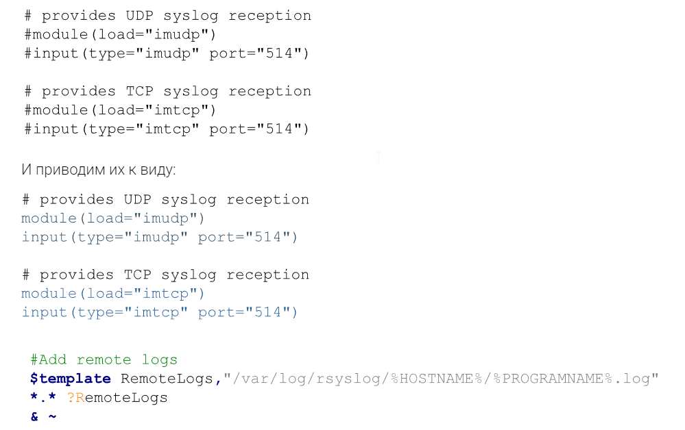

# Logging
Основы сбора и хранения логов 
1. vagrant up. результатом станет 2 машины web и log
2. Настраиваем на обоих NTP что бы время везде было одинаковое.  ``` dpkg-reconfigure tzdata ```
3. Установим nginx на VM web: apt update && apt install -y nginx  и проверим, что nginx работает корректно
```
root@vagrant:~# systemctl status nginx
● nginx.service - A high performance web server and a reverse proxy server
     Loaded: loaded (/lib/systemd/system/nginx.service; enabled; vendor preset: enabled)
     Active: active (running) since Sun 2024-06-16 11:33:07 +04; 24s ago
       Docs: man:nginx(8)
    Process: 3483 ExecStartPre=/usr/sbin/nginx -t -q -g daemon on; master_process on; (code=exited, status=0/SUCCESS)
    Process: 3484 ExecStart=/usr/sbin/nginx -g daemon on; master_process on; (code=exited, status=0/SUCCESS)
   Main PID: 3575 (nginx)
      Tasks: 3 (limit: 1586)
     Memory: 4.7M
        CPU: 92ms
     CGroup: /system.slice/nginx.service
             ├─3575 "nginx: master process /usr/sbin/nginx -g daemon on; master_process on;"
             ├─3578 "nginx: worker process" "" "" "" "" "" "" "" "" "" "" "" "" "" "" "" "" "" "" "" "" "" "" "" "" "" "" ""
             └─3579 "nginx: worker process" "" "" "" "" "" "" "" "" "" "" "" "" "" "" "" "" "" "" "" "" "" "" "" "" "" "" ""

Jun 16 11:33:07 vagrant systemd[1]: Starting A high performance web server and a reverse proxy server...
Jun 16 11:33:07 vagrant systemd[1]: Started A high performance web server and a reverse proxy server.
root@vagrant:~# ss -tln | grep 80
LISTEN 0      511          0.0.0.0:80        0.0.0.0:*
LISTEN 0      511             [::]:80           [::]:*
```
4. Настройка центрального сервера сбора логов   на машине **log**
5. так же установим правильное время из под root
6.  ``` apt list rsyslog ```
7.  Все настройки Rsyslog хранятся в файле /etc/rsyslog.conf  - правим файл
8.  Открываем порт 514 (TCP и UDP): Находим закомментированные строки:
9.   
```
root@vagrant:~# systemctl restart rsyslog
root@vagrant:~# ss -tuln
Netid                State                 Recv-Q                Send-Q                                Local Address:Port                               Peer Address:Port               Process
udp                  UNCONN                0                     0                                           0.0.0.0:514                                     0.0.0.0:*
udp                  UNCONN                0                     0                                     127.0.0.53%lo:53                                      0.0.0.0:*
udp                  UNCONN                0                     0                                    10.0.2.15%eth0:68                                      0.0.0.0:*
udp                  UNCONN                0                     0                                              [::]:514                                        [::]:*
tcp                  LISTEN                0                     25                                          0.0.0.0:514                                     0.0.0.0:*
tcp                  LISTEN                0                     4096                                  127.0.0.53%lo:53                                      0.0.0.0:*
tcp                  LISTEN                0                     128                                         0.0.0.0:22                                      0.0.0.0:*
tcp                  LISTEN                0                     25                                             [::]:514                                        [::]:*
tcp                  LISTEN                0                     128                                            [::]:22                                         [::]:*
root@vagrant:~# systemctl status rsyslog
● rsyslog.service - System Logging Service
     Loaded: loaded (/lib/systemd/system/rsyslog.service; enabled; vendor preset: enabled)
     Active: active (running) since Sun 2024-06-16 11:55:13 +04; 32s ago
```
10. Далее настроим отправку логов с web-сервера. Проверим версию nginx: ``` nginx -v ```
```
root@vagrant:~# nginx -v
nginx version: nginx/1.18.0 (Ubuntu)
```
11. в файле /etc/nginx/nginx.conf раздел с логами и приводим их к следующему виду:
12. 
13. **Заметка для себя**
14. **Для Access-логов указываем удаленный сервер и уровень логов, которые нужно отправлять. Для error_log добавляем удаленный сервер. Если требуется чтобы логи хранились локально и отправлялись на удаленный сервер, требуется указать 2 строки. 	
Tag нужен для того, чтобы логи записывались в разные файлы.
По умолчанию, error-логи отправляют логи, которые имеют severity: error, crit, alert и emerg. Если требуется хранить или пересылать логи с другим severity, то это также можно указать в настройках nginx.**
```
root@vagrant:~# nginx -t
nginx: the configuration file /etc/nginx/nginx.conf syntax is ok
nginx: configuration file /etc/nginx/nginx.conf test is successful
root@vagrant:~# systemctl restart nginx
```
15. Попробуем несколько раз зайти по адресу http://192.168.56.10
16. Далее заходим на log-сервер и смотрим информацию об nginx:
```
cat /var/log/rsyslog/web/nginx_access.log 
cat /var/log/rsyslog/web/nginx_error.log 
```
17. Поскольку наше приложение работает без ошибок, файл nginx_error.log не будет создан. Чтобы сгенерировать ошибку, можно переместить файл веб-страницы, который открывает nginx - 
mv /var/www/html/index.nginx-debian.html /var/www/ После этого мы получим 403 ошибку.
18. 
19. и далее видим, что логи не отправляются..
```
root@vagrant:~# cat /var/log/rsyslog/web/nginx_access.log
cat: /var/log/rsyslog/web/nginx_access.log: No such file or directory
root@vagrant:~# cat /var/log/rsyslog/web/nginx_error.log
cat: /var/log/rsyslog/web/nginx_error.log: No such file or directory
 ```
20. **Ошибку не нахожу- прошу подсказать где ошибся**


 
